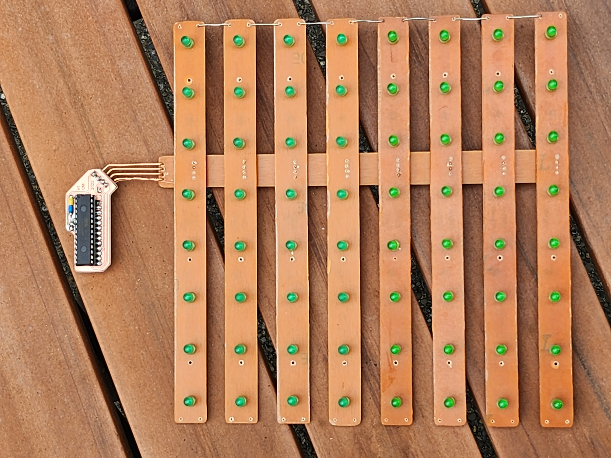

# Conway-8x8
8x8 Circuit Sculpture of Conway's Game of Life

   This project is the collection of files necessary to make the above pictured 8x8 grid sculpture playing out [Conway's Game of Life](https://www.youtube.com/watch?v=Kk2MH9O4pXY) on an ATmega 328P. This project spanned 3 separate periods: 110 hours were spent developing the original software and building a circuit sculpture for a [separate 6x6 design](./media/6x6_design.jpg) which maxed the CPU capabilities; 20 hours were spent doing a technical analysis, refactoring, and writeup of the data structure to scale from 6x6 to larger sizes; 130 hours over 3 weeks were then spent developing this project into new physical hardware. 
   The 130-hour period is captured in this github. This time was spent integrating the new 8x8 software to match new hardware, conceptualizing the full physical design from scratch, modeling the wooden case in Fusion360, designing the circuit boards in KiCad, producing CNC gcode for the PCBs and case in Fusion360, cutting the wood and copper/fr4 circuit boards on an Onefinity CNC machine, treating the wood and creating epoxy lenses, soldering the circuits, as well as testing and improving the design while in-progress. The project was created to demonstrate hardware implementation of a data structure (from concept to physical object) for a classroom grade, as this process is much more complicated than a sole-software approach. Unfortunately, the project did not count for very much credit, however the entire process was quite therapeutic and educational, and I was very pleased with the results.

## What the Sculpture Does

   The sculpture creates a random gameboard using a floating microcontroller pin, and then applies Conway’s rules to evolve which cells live or die. The floating pin can detect random energy in the air to seed the RNG. The gameboard itself represents an infinitely repeating 8x8 grid in every direction, as the top/bottom and left/right sides are considered ‘touching’ for the evolution process. Another way to visualize this is as a grid stretched over a [torus](https://en.wikipedia.org/wiki/Torus). The current implementation remembers 48 board histories to check for duplicates, as a duplicate gameboard will always evolve along the same path which traps the display into repeating itself forever. The bulk of the processor’s memory is used in saving these histories. If duplicate is detected, the living cells flash out of existence to let the observer know they ‘lived forever’, and a new gameboard is generated. Otherwise, the game will continue to play out until all cells die out, and afterward a new board will be generated. This 8x8 board has 68,719,476,736 unique starting conditions possible. 
   You can see the sculpture running in the video below. Unfortunately, the camera shutter speed clashes a bit with the FPS of the sculpture and the video footage doesn’t look as good as seeing it run in person. Lopsided ‘blinky’ math is used to transition cells on and off to make it easier for the brain to track the groups of cells dying and coming alive. The video was recorded while testing that the sculpture display matched what the software was providing, with an external Arduino streaming data to the display and the laptop simultaneously.
<video src=’./media/running_test.mp4' width=240/>

   I enjoy seeing the display run from behind the sculpture, where the LEDs can be seen through the circuit boards.
<video src=’./media/running_rear.mp4' width=240/>

## The Project’s Goals
   The intent of the project had two primary purposes: refactor the existing software data structure to be more efficient, and to develop new techniques for physical hardware creation. In software, a technical analysis of the original 6x6 data structure was done and improvements were made to allow up to a 32x32 size (while still maintaining auto-reset features to detect if a repeating pattern emerged). Methods for further improvement were also discovered, but not yet implemented. After the software was improved, an 8x8 size for the hardware was chosen for timeline practicality. In hardware, the goals were to create working SMD circuits using a CNC process, integrating multiple of these PCBs together into a larger overall circuit, designing this circuit alongside a tailor-cut housing to host them, and to attempt using epoxy as an appealing LED lens.
   The software was developed in Arduino IDE v1.8.13. [The source code is provided here](./src/conway3).

## The Build Log
  The rest of this readme is designed as a build log. The build process is documented below for anyone wishing to recreate this sculpture. STL files for all housing pieces are located [here](./models), KiCad files for the circuit are provided [here](./kicad/conway), and images of the different PCB traces for an etching process are provided [here](./pcb_svg_images). Creating/providing gcode is outside the scope of this writeup, as the process is highly dependent on the specific tools used to manufacture.
   The housing is made from poplar wood, a light wood with a subtle natural greenish tint. The feet (and failed trim) are made from sapele, a naturally red wood. The wood and PCBs were all sealed with a polyurethane spray for protection. The circuits are all cut from single-sided copper fr4 PCB blanks. The CPU is a standalone ATmega 328P, 10k resistor (with yellow/blue shrink), and 10uF capacitor (seen on the rear). The LED PCBs use [74HC595 shift registers]( https://www.digikey.com/en/products/detail/nexperia-usa-inc/74HC595D-118/763087), [470 Ohm resistor arrays](https://www.digikey.com/en/products/detail/bourns-inc/CAY16-471J4LF/2566756), and generic green 3V 20mA LEDs. A generic USB PCB was soldered to the GND and 5V lines of the bus PCB (the 328P chip used does not support USB data, so only power was connected).

After developing the software, the circuits were drawn in KiCad (v5.1.9) to find the practical sizes and shapes for the circuit boards.

Once the circuits were designed and sized, the wooden housing was modeled in Fusion360 and the back of the housing was cut. Wooden pillars were used to place the wood stock precisely on the CNC bed, as the board would need flipped on the next step, and the pillars allowed for exact X and Y axis alignment. Before cutting, a small amount of polyurethane was sprayed where the text engraving would be. After cutting, this engraving area was taped off and sprayed with black spray paint. After drying, sanding the area removes the excess paint and leaves the engraved text painted.

The wooden board was then flipped, aligned to the bed’s peg holes, and front was then cut. The front used different bits to create the wavy pattern, cut away bulk material, and drill the LED holes. The same spray paint technique from before was used to fill the LIFE lettering with black paint (green epoxy was added later).

A two-step process was used for the epoxy. First, clear tape was placed over the display face and a small amount of 2-part green epoxy was poured into the holes from behind. After the epoxy had time to set, the tape was removed and a different UV epoxy was added in a droplet-shape to create a magnifying lens over the top, then hardened with a UV light into its round shape. This picture shows the piece of scrap wood to test the process. Only one of the 5 test pours pictured has the UV lens over the top.

Additional trim was modeled and cut, with the plan to have more contrast in the design.

This did not work out as planned, though. The trim wood was cut to only be 3mm thick, but the board used was not perfectly flat and this resulted in a failed cut. Pre-processing the board flatter with a surfacing bit could have prevented this. There wasn’t enough sapele left in my shop to try again, so the contrasting trim idea was scrapped along with the failed cuts.  

Luckily, the section of sapele reserved for the feet was still usable, and this cut went well.

The LED PCBs were then cut on the CNC machine. The electrical traces are 0.7mm wide, and I had not cut this finely before. A total of 4 different bits were used before finding a 60-degree (inclusive) carbide bit that cut well at around 10k RPM. Around 15 PCBs were cut, with 8 being usable in the end. You can see some of the progress from right to left in the picture.

Each PCB was hand soldered using lead-free low temperature solder.

The LED PCBs were then assembled using the bus PCB, and the brain PCB was attached using solid-core wire (to create a floating effect) and a thin data wire was run to the data-in of the first LED PCB. All the data-out/data-in ports on the LED PCBs were then connected using solid core wire along the side of the structure. The USB port was also connected to the bus PCB, but only 5v and GND were connected to the USB port. 

The display was tested by streaming data from an Arduino (with a 328P processor) with jumper wires, making sure it matched up with what the software was outputting (shown in a video above). After the testing was verified, the copper was sprayed with polyurethane to protect it from moisture.

Once all testing was complete, a standalone 328P was flashed with the program (using the internal oscillator) and the circuit was attached to the housing with screws. The view from the rear while its running is still my favorite.

If you’ve made it this far, extra thanks for taking a look! If you make one, be sure to let me know!

